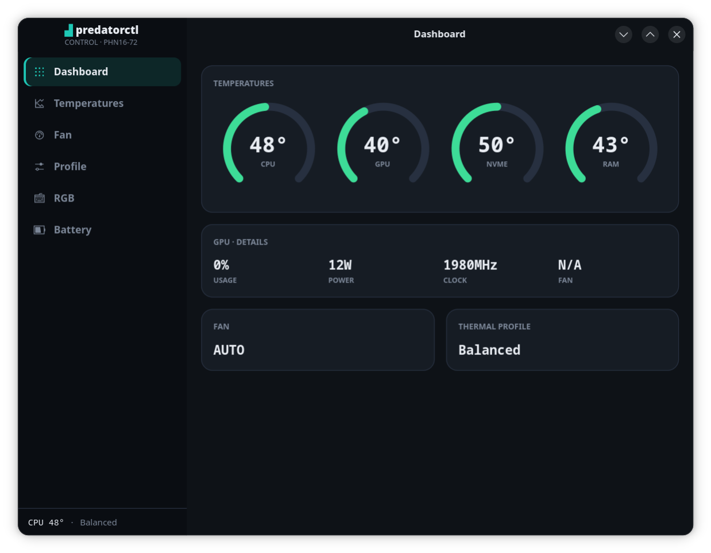
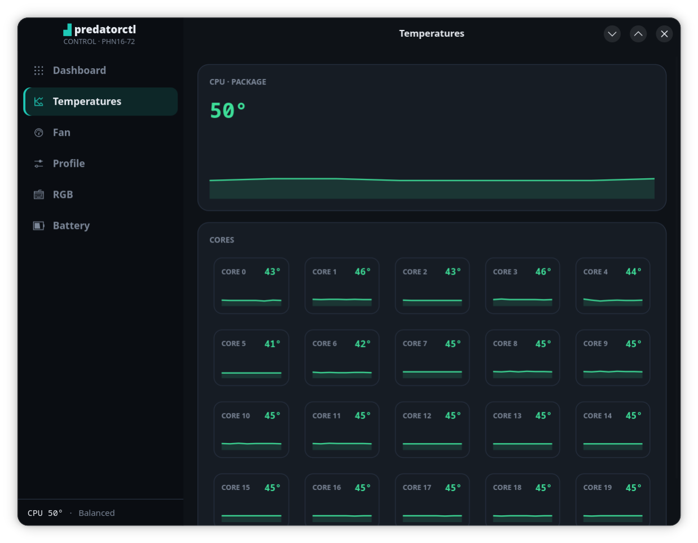
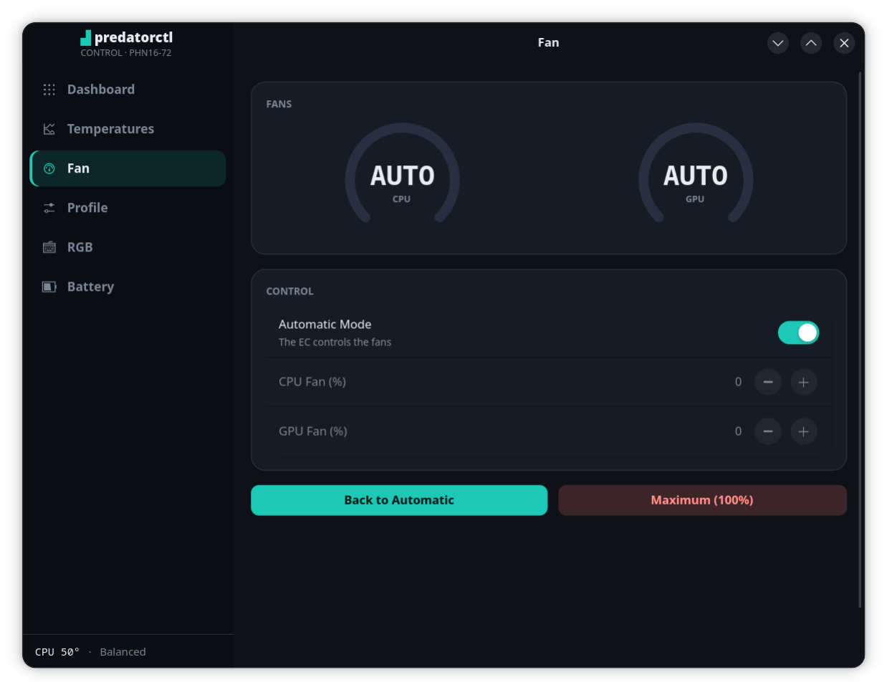
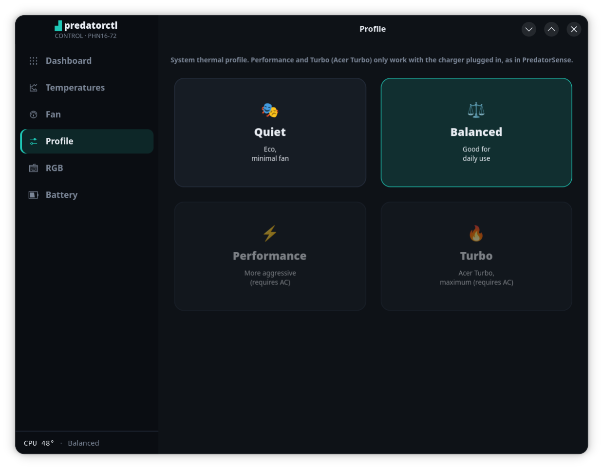
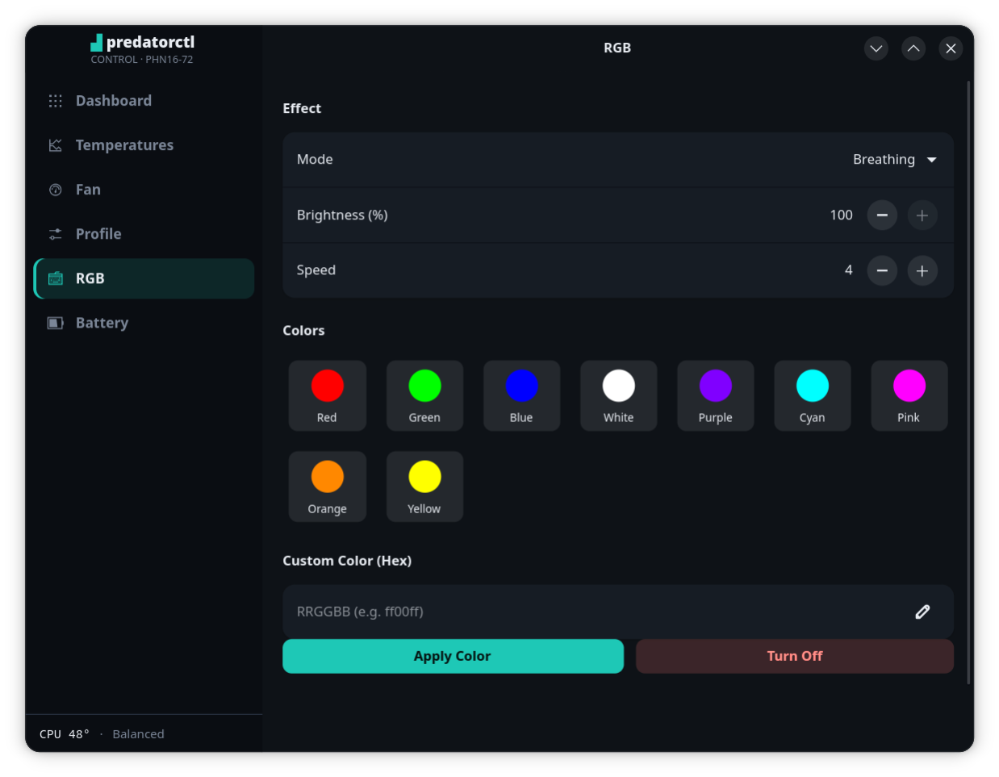
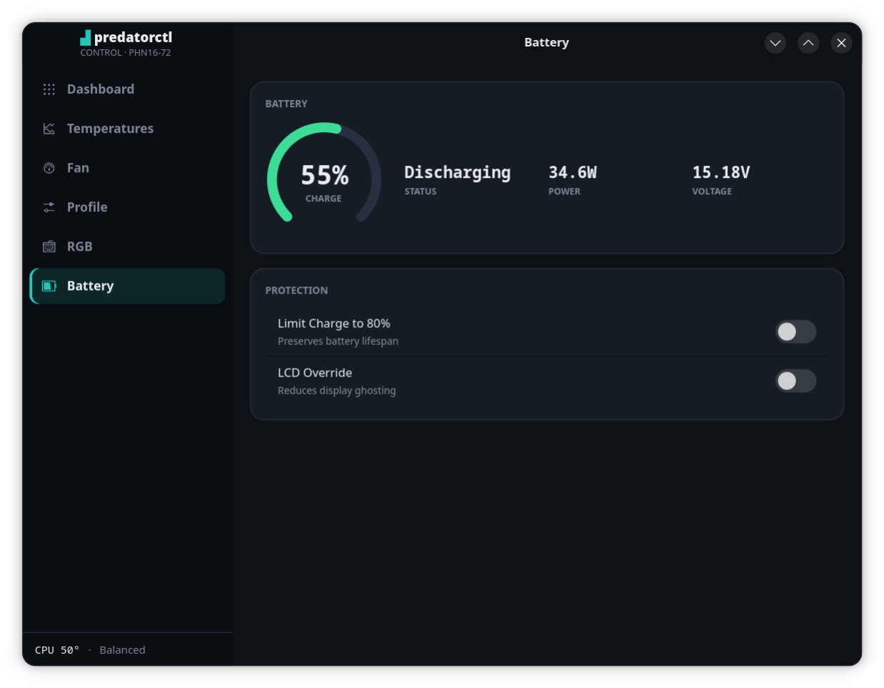

**English** | [Português (BR)](README.pt-BR.md)

# predatorctl

A GTK4/libadwaita control center for **Acer Predator** (and Nitro) gaming laptops on Linux: live temperatures, fan control, thermal profiles (including Turbo), 4-zone keyboard RGB and battery protection — with a deliberately **minimal privilege surface** (no passwordless polkit rules, no custom kernel module, no root daemon).



## Features

- **Dashboard** — radial gauges for CPU / GPU / NVMe / RAM temperatures, GPU telemetry (usage, power, clock, fan), current fan mode and thermal profile.
- **Temperatures** — CPU package history graph plus per-core sparklines.
- **Fan control** — auto (EC-controlled) or manual CPU/GPU fan duty (0–100%), plus a one-click "Max" panic button.
- **Thermal profiles** — the real Acer profiles (Eco / Balanced / Performance / Turbo) via `platform_profile`. Performance and Turbo are firmware-gated to AC power (same behavior as official PredatorSense); the UI disables them on battery instead of failing silently.
- **Keyboard RGB** — 4-zone animated effects (breathing, neon, wave, shifting, zoom) with color, brightness and speed.
- **Battery** — charge/power/voltage readout, 80% charge limiter, LCD override.

### Screenshots

| Temperatures | Fan control |
|---|---|
|  |  |

| Thermal profiles | Keyboard RGB |
|---|---|
|  |  |

| Battery | |
|---|---|
|  | |

Sensors are auto-detected by chip *type* via `sensors -j` (Intel `coretemp` or AMD `k10temp`/`zenpower`, any NVMe, `spd5118`/`jc42` RAM, NVIDIA via `nvidia-smi` with an `amdgpu` fallback), so temperature readout works across the Predator/Nitro family — developed and tested on a **Predator Helios Neo 16 (PHN16-72)**. The hardware *controls* require the `linuwu_sense` sysfs interface (see below); on unsupported machines reads show `N/A` and writes fail cleanly.

## Security model (why this exists)

Existing tools for this hardware tend to demand a scary amount of trust: passwordless polkit rules, custom out-of-tree kernel modules, direct Embedded Controller access, `curl | sudo bash` installers. predatorctl was written from scratch to avoid all of that:

- **Reads are unprivileged.** All telemetry comes from world-readable sysfs and unprivileged commands (`sensors`, `nvidia-smi`).
- **Writes go through one tiny helper** (`helper/predatorctl-helper`, ~130 lines — read it!). It is the *only* code that ever runs as root. It refuses to run without root, only writes to a hard-coded whitelist of sysfs paths, and strictly validates every value before writing.
- **No passwordless escalation.** The polkit rule grants `auth_admin_keep`: you type your password once and it is cached for ~5 minutes, like sudo. The rule only matches the root-owned installed helper path.
- **No kernel code of its own.** It drives the independently developed, open-source [linuwu_sense](https://github.com/0x7375646F/Linuwu-Sense) module you install yourself.

## Compatibility

**Hardware** — the controls need a laptop supported by [`linuwu_sense`](https://github.com/0x7375646F/Linuwu-Sense#supported-models):

| Laptop | Status |
|---|---|
| Predator Helios Neo 16 (PHN16-72) | ✅ Fully tested (development machine) |
| Other Predators supported by linuwu_sense | ✅ Expected to work fully (same `predator_sense` sysfs) |
| Nitro models supported by linuwu_sense | ⚠️ Temperatures, thermal profiles and keyboard RGB expected to work; fan control and battery limiter live under `nitro_sense`, not wired up yet (writes fail cleanly) — contributions welcome |
| Any other laptop | 📊 Read-only telemetry (temperatures via `lm_sensors`/`nvidia-smi`); controls show `N/A` and fail cleanly |

**Software** — any Linux distribution with GTK4 + **libadwaita ≥ 1.4**, a modern polkit (JS `rules.d`) and Python ≥ 3.10:

| Distribution | Status | Packages |
|---|---|---|
| Arch / Manjaro | ✅ Tested | `python-gobject gtk4 libadwaita lm_sensors polkit` |
| Ubuntu 24.04+ / Debian 13+ | ✅ Should work | `python3-gi gir1.2-gtk-4.0 gir1.2-adw-1 lm-sensors polkitd` |
| Fedora 39+ | ✅ Should work | `python3-gobject gtk4 libadwaita lm_sensors polkit` |
| Ubuntu 22.04 | ❌ | libadwaita 1.1 is too old (widgets from 1.4 are used) |

Desktop environment doesn't matter (GNOME, KDE Plasma, etc., X11 or Wayland) — the app ships its own dark "instrument" theme either way.

## Requirements

- An Acer Predator/Nitro laptop supported by [`linuwu_sense`](https://github.com/0x7375646F/Linuwu-Sense), with the module loaded (it replaces the in-tree `acer_wmi`). You can follow that project's instructions, or use the **optional** helper included here, which sets it up with DKMS so kernel updates don't silently remove it:

  ```bash
  sudo ./install-linuwu-dkms.sh                       # clones upstream and installs via DKMS
  sudo ./install-linuwu-dkms.sh ~/src/Linuwu-Sense    # or use a local checkout you've audited
  sudo ./install-linuwu-dkms.sh --uninstall           # undo everything (acer_wmi returns on reboot)
  ```

  (also available as `sudo make linuwu [LINUWU_SRC=~/src/Linuwu-Sense]`)
- System packages (this is not a pip project — PyGObject binds to system GTK):
  - `python-gobject`, `gtk4`, `libadwaita` (Arch names; use your distro's equivalents)
  - `lm_sensors` (for `sensors -j`)
  - `nvidia-utils` (optional, for NVIDIA GPU telemetry)
  - `polkit` (for `pkexec`)

## Running from source

```bash
git clone https://github.com/rdmsilva/predatorctl.git
cd predatorctl
python3 src/main.py    # or: make run
```

Run from source, every hardware write prompts for your password (the polkit rule only matches the installed path — fine for trying it out).

## Installing

```bash
sudo ./install.sh      # or: sudo make install
predatorctl            # or launch "Predator Control" from your app menu
```

This installs to `/usr/local/lib/predatorctl` plus the launcher, menu entry and polkit rule.

The installer copies the app to a root-owned directory (a user-writable root-executed script would be an escalation vector), registers the `.desktop` entry/icon and installs the `auth_admin_keep` polkit rule for members of `wheel`/`sudo`.

```bash
sudo ./uninstall.sh    # or: sudo make uninstall
```

## Tests

No hardware needed — parsers, validation and value formats are tested with everything mocked:

```bash
make test          # or: python3 -m unittest discover tests -v
```

(`make help` lists the other shortcuts: `run`, `install`, `uninstall`, `clean`.)

## Architecture

Hexagonal (ports & adapters), organized around the one boundary that matters — unprivileged reads vs. privileged writes:

```
src/domain/      models + ports (SensorPort read / ControlPort write) — no GTK, no sysfs
src/adapters/    sysfs_sensors.py (reads), pkexec_control.py (writes via pkexec)
src/ui/          GTK4/libadwaita pages (dashboard, temperatures, fan, profile, rgb, battery)
helper/          predatorctl-helper — the only code that runs as root
data/            .desktop entry, icon, polkit rule
```

`src/main.py` is the composition root: swap the adapters for fakes there and the whole UI runs off-hardware. See `CLAUDE.md` for a deeper tour (value formats, threading model, hardware quirks).

## Disclaimer

This software writes to fan and thermal controls exposed by your laptop's firmware through `linuwu_sense`. It only uses interfaces the vendor's own software uses, and validates everything it writes — but as with any hardware control tool, **use at your own risk**.

## Credits

- [0x7375646F/Linuwu-Sense](https://github.com/0x7375646F/Linuwu-Sense) — the kernel driver that makes all of this possible.

## License

[GPL-3.0-or-later](LICENSE)
